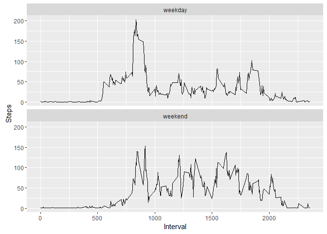

# Reproducible Research: Peer Assessment 1

## Loading and preprocessing the data

```r
library(knitr)
library(ggplot2)
options(scipen = 1, digits = 2)

url <- "https://d396qusza40orc.cloudfront.net/repdata%2Fdata%2Factivity.zip"
download.file(url, destfile = "./repdata_data_activity.zip")
unzip("repdata_data_activity.zip")
activity <- read.csv("activity.csv")
#Convert factor to date
activity$date <- as.Date(activity$date, format = "%Y-%m-%d")
```

## What is mean total number of steps taken per day?
1. Make a histogram of the total number of steps taken each day

```r
activityNoMissing <- activity[complete.cases(activity),]
activityByDay <- aggregate(list(Steps = activityNoMissing$steps), by = list(Date = activityNoMissing$date), FUN = sum)
hist(activityByDay$Steps, xlab = "Number of Steps", main = "Histogram of the Total Number of Steps Taken per Day")
```

<!-- -->

2. Calculate and report the mean and median total number of steps taken per day

```r
meanSteps <- mean(activityByDay$Steps)
medianSteps <- median(activityByDay$Steps)
```
The mean total number of steps taken per day is **10766.19**.
The median total number of steps taken per day is **10765**.

## What is the average daily activity pattern?

1. Make a time series plot (i.e. type = "l") of the 5-minute interval (x-axis) and the average number of steps taken, averaged across all days (y-axis)

```r
activityByInterval <- aggregate(list(Steps = activityNoMissing$steps), by = list(Interval = activityNoMissing$interval), FUN = mean)
plot(activityByInterval$Interval, activityByInterval$Steps, type = "l", xlab = "Interval", ylab = "Number of Steps", main = "Average Number of Steps Taken Per 5-Minute Interval")
```

<!-- -->

2. Which 5-minute interval, on average across all the days in the dataset, contains the maximum number of steps?

```r
maxInterval <- activityByInterval[which.max(activityByInterval$Steps),]
```
The **835** 5-minute interval on average across all the days in the dataset contains the maximum number of steps: **206.17**.

## Imputing missing values 
1. Calculate and report the total number of missing values in the dataset (i.e. the total number of rows with NAs)

```r
totalMissingRows <- dim(activity)[1]-dim(activityNoMissing)[1]
```

The total number of missing values in the dataset is **2304**.

2. Devise a strategy for filling in all of the missing values in the dataset. The strategy does not need to be sophisticated. For example, you could use the mean/median for that day, or the mean for that 5-minute interval, etc.

I will fill in the missing values in the dataset with the mean of the following

* mean value for the day
* mean for the 5-minute interval

3. Create a new dataset that is equal to the original dataset but with the missing data filled in.

```r
#Mean number of steps by day
meanActivityByDay <- aggregate(list(DaySteps = activityNoMissing$steps), by = list(Date = activityNoMissing$date), FUN = mean)

#Generate all possible Date/Interval Combinations
allCombinations <- expand.grid(unique(activity$date), unique(activity$interval))
names(allCombinations) <- c("Date","Interval")

#Add the Date and Interval averages
allCombinations <- merge(allCombinations, meanActivityByDay, all.x = TRUE)
allCombinations <- merge(allCombinations, activityByInterval, all.x = TRUE)

#Average the mean value for the day and the mean for the 5-minute interval
#if a particular day or interval is missing all values, the average for the other is used
#there is no combination of day and interval where both are missing all values
allCombinations$Average <- apply(allCombinations[,c('Steps','DaySteps')], 1, function(x) {mean(x, na.rm = TRUE)})

#Impute the values
activityImputed <- activity
activityImputed$steps <- ifelse(is.na(activityImputed$steps),
subset(allCombinations,allCombinations$Date == activityImputed$date &
       allCombinations$Interval == activityImputed$interval)$Average,activityImputed$steps)
```

4. Make a histogram of the total number of steps taken each day and Calculate and report the mean and median total number of steps taken per day. Do these values differ from the estimates from the first part of the assignment? What is the impact of imputing missing data on the estimates of the total daily number of steps?

```r
activityImputedByDay <- aggregate(list(Steps = activityImputed$steps), by = list(Day = activityImputed$date), FUN = sum)
hist(activityImputedByDay$Steps, xlab = "Number of Steps", main = "Histogram of the Total Number of Steps Taken per Day")
```

<!-- -->

```r
meanImputedSteps <- mean(activityImputedByDay$Steps)
medianImputedSteps <- median(activityImputedByDay$Steps)
```
The mean total number of steps taken per day is **9419.08**.
The median total number of steps taken per day is **10395**.

The values differ from the estimates from the first part of the assignment. The impact of imputing missing data on the estimates of the total daily number of steps decreases the mean total number of steps taken per day by **1347.11** and the median by **370**.

## Are there differences in activity patterns between weekdays and weekends?
1. Create a new factor variable in the dataset with two levels -- "weekday" and "weekend" indicating whether a given date is a weekday or weekend day.

```r
activityImputed$weekend <- as.factor(ifelse(weekdays(activityImputed$date) %in% c("Saturday","Sunday"), "weekend", "weekday"))
```

2. Make a panel plot containing a time series plot (i.e. type = "l") of the 5-minute interval (x-axis) and the average number of steps taken, averaged across all weekday days or weekend days (y-axis). 

```r
activityByIntervalAndWeekend <- aggregate(list(Steps = activityImputed$steps), by = list(Interval = activityImputed$interval, Weekend = activityImputed$weekend), FUN = mean)

#use ggplot2
qplot(Interval, Steps, data = activityByIntervalAndWeekend, geom = "line") + facet_wrap( ~ Weekend, ncol = 1)
```

<!-- -->
